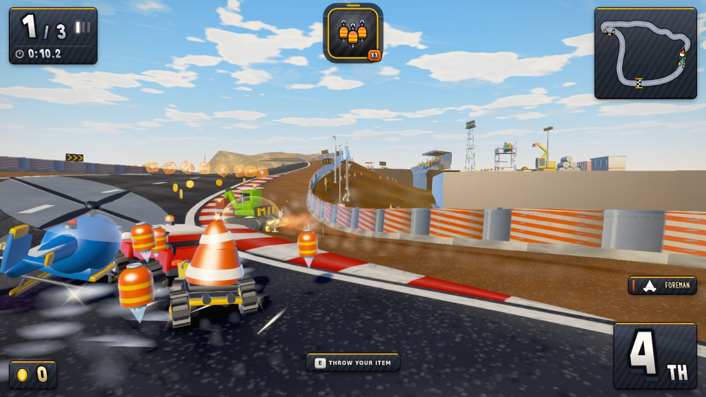
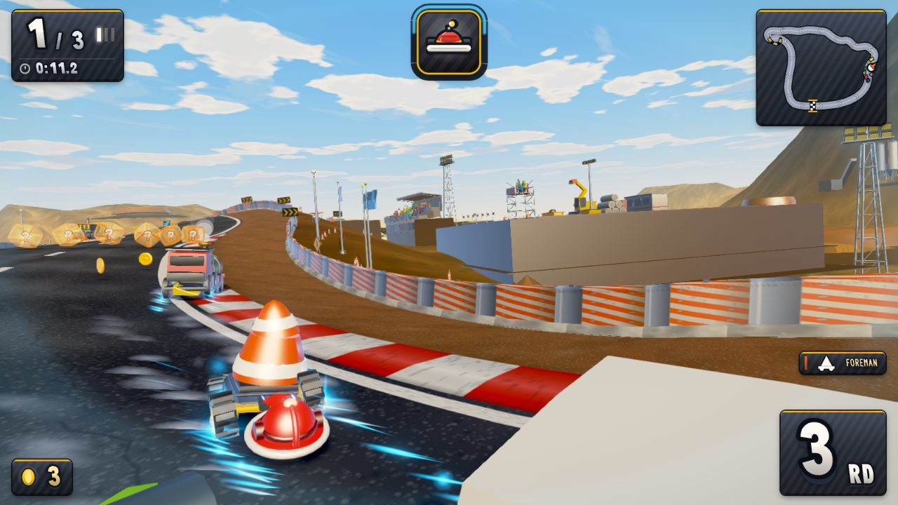
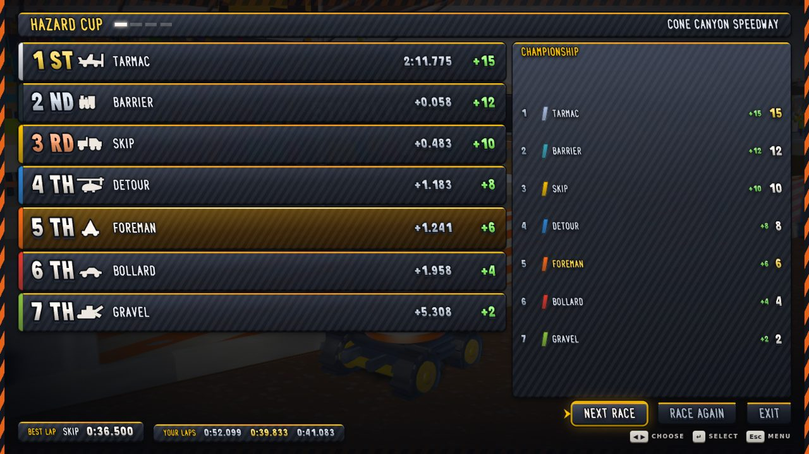
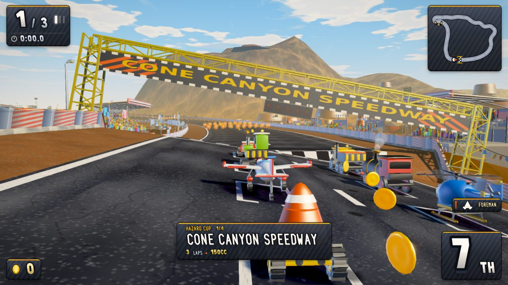
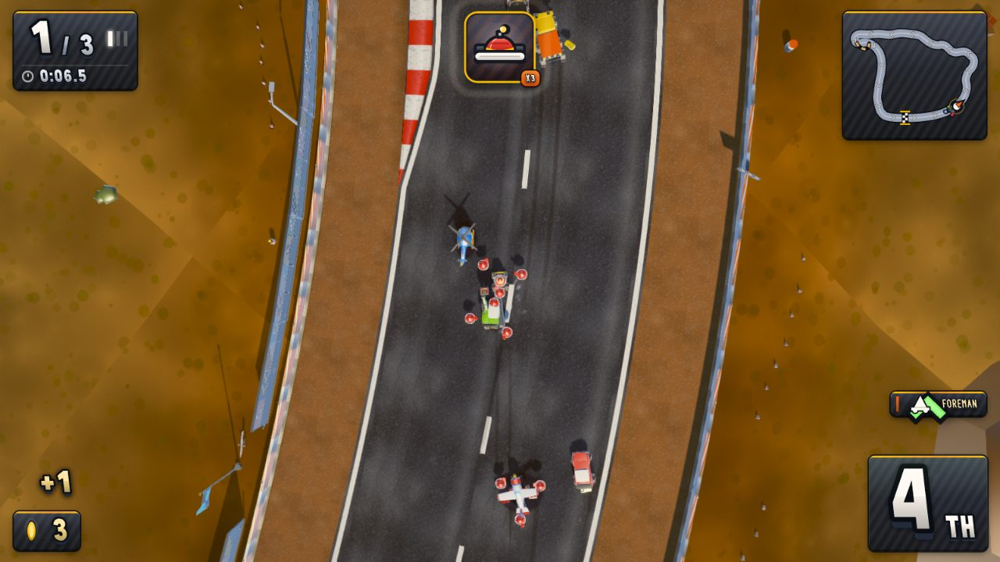

# MARIO.CONE

A kart racer where the drivers are roadworks. A road cone, a plane, a
helicopter, a digger, a train, a truck and a car race four circuits through a
canyon full of hazard tape, and the whole thing runs in a browser tab.

**▶ Play it: <https://adam91holt.github.io/mario.cone/>**

Live build board: <https://adam91holt.github.io/mario.cone/progress.html>



---

## Controls

| | |
|---|---|
| **↑ / W** | Accelerate |
| **↓ / S** | Brake |
| **← →** | Steer |
| **Space** | Hop, and hold through a corner to drift |
| **E** | Throw your item |
| **Q** | Look back |
| **Esc** | Pause |
| **H** | Show the controls card |

A gamepad works too — RT to accelerate, RB to drift, LB for items.

Two things aren't obvious and are where the speed lives. **Hold Space through a
corner** to charge a mini-turbo: the sparks go blue, then green, then purple,
and releasing pays out a boost scaled to how long you held it. And **hold
accelerate through the last beat of the countdown** — not on the green, through
the beat *before* it — for a rocket start. Hold it too early and you bog down.



---

## How it's built

Everything is procedural. There are **no asset files** — no textures, no models,
no audio samples, no fonts. Every machine, every letter of every word on screen,
every engine note and every grain of canyon dust is generated in code at boot.
The build is one 1.4 MB JavaScript file (440 KB gzipped) and nothing else, so it
loads on a phone and runs offline.

- **TypeScript + Three.js**, bundled with Vite, strict compiler settings.
- **Deterministic simulation.** All gameplay runs in `fixedUpdate(dt)` at a
  constant 120 Hz against a seeded RNG. No `Math.random()`, no wall-clock reads.
  The same seed and the same inputs produce the same race, frame for frame,
  which is what makes the whole review process below possible.
- **Visuals are separate.** `update(dt, alpha)` runs once per rendered frame and
  may only interpolate. Anything that decides who wins goes in `fixedUpdate`;
  anything that decides how it looks goes in `update`.

### It was built by agents working in parallel

**→ [How it works, with diagrams](docs/how-it-works.md)** — the build board, the
review loop, the critic protocol, and why a pass that owns the whole repo had to
exist.

This repo is an experiment in whether a large number of AI agents can build
something to a genuinely high bar without a human reviewing each change.

The game is split into **pieces** — physics feel, camera, track, the vehicle
cast, items, HUD, AI, audio, world dressing, race flow, menus, courses, theme
wiring, performance. Each piece is owned by one agent that may edit **only that
piece's files**. `ARCHITECTURE.md` is the contract, and `src/types.ts` encodes it
as real types so `npm run typecheck` catches a cross-module break.

Every piece is then judged by a **separate agent with fresh context** that has
never seen the builder's work or its summary. That critic:

1. Writes down what the equivalent moment in Mario Kart 8 Deluxe looks and feels
   like, **from memory, before looking at this game at all** — so it can't
   unconsciously grade on a curve once it has.
2. Drives the real build through a scripted harness and reads the actual
   rendered frames.
3. Puts the two side by side and says plainly which it would rather be playing.
4. Returns a score, the single biggest gap in one sentence, and a directive
   specific enough to act on without asking a question.

If the critic can name a gap a player would notice, the piece fails and goes
back. The bar to pass is 8.5/10 against a shipped Nintendo game, and the loop has
no fixed number of rounds.

### The critics are harsh, and specific

Real verdicts from the log — this is the level the loop operates at:

> The menu stage casts no contact shadow: ground luminance under the digger's
> tracks reads **96.9 against 42.4** for the asphalt beside it. The same machine
> on the race grid a quarter-second later is correctly 30% darker.

> The rocket start is inverted. Pressing accelerate *on* the green — a 0.1s
> reaction window — gives 1.38s of boost and 119.3 m in two seconds. Holding
> through the final beat, which is Mario Kart's actual rocket window, gives
> nothing and 41.5 m.

> The quality governor sat at its top rung for **331 seconds at roughly 4 fps**
> without a single change, because its warm-up gate is counted in rendered frames
> and the number it reads under-reports a GPU-bound frame by twentyfold.

### And a pass that owns the whole repo

Strict file ownership is what lets many agents work at once, and it has a cost
nothing else can pay: **nobody owns the space between the pieces.** Two agents
each pick a defensible yellow, each passes its own critic, and the game ends up
looking like it was made by people who never met.

So `tools/coherence.workflow.mjs` runs one agent with whole-repo ownership,
judged by a critic scoring the game as a single work. Its first survey found
fourteen seams and opened with:

> A bag of very good parts, and the parts know it — several files carry comments
> apologising for the space they cannot reach across.

It found that the game was set in two different typefaces either side of the
starting flag, that eleven events were emitted every race into a room with no
listeners (which is why the wrong-way alarm had no alarm), and that eight racers
were finishing 6.5 km of racing **inside 0.811 seconds of each other**, so the
drift loop the menus call "the real game" was something a player never once saw
happen.



---

## The harness

Every agent, builder and critic alike, drives the game through `window.__GAME`
in `src/core/harness.ts`:

```js
__GAME.reset()             // fresh race, same seed
__GAME.step(seconds)       // advance the simulation with no drawing — fast
__GAME.advance(seconds)    // advance and render
__GAME.setInput({ steer, accel, drift, item })
__GAME.setAutopilot(true)  // let the AI drive the player's machine
__GAME.snapshot()          // every racer's position, speed, place, lap, surface…
__GAME.stats()             // draw calls, triangles, frame timing
```

Because the simulation is deterministic, a critic's screenshot is reproducible
and a bug report is a seed plus a time. The tools built on it:

| tool | what it does |
|---|---|
| `capture.mjs` | the twelve-shot review sheet every critic reads |
| `trace.mjs` | a timeline of speed, lap, place, surface, camera |
| `clip.mjs` | deterministic video recording |
| `journey.mjs` | walks the whole game front to back, menus included |
| `racelog.mjs` | finishing spreads across the field |
| `steercheck.mjs` | drives real key events and measures which way the kart went |
| `qualitydiff.mjs` | proves a quality change moves no racer |
| `progress.mjs` | renders the live build board |

`steercheck.mjs` exists because of a bug worth repeating: steering was mirrored
for weeks. The harness couldn't catch it, because `setInput()` writes the virtual
input and short-circuits the exact device path that was broken. The AI drove
correctly the whole time — its maths was right, and a comment above it asserted
the opposite convention on every count. The keyboard mapping had been written to
match the comment.



---

## The prompts

Nobody hand-wrote the TypeScript in this repository. It was built by agents
working from a conversation, so the prompts are closer to the source than `src/`
is — and they are committed here alongside it, refreshed as the build runs.

- **[`docs/session/prompts.md`](docs/session/prompts.md)** — every prompt and
  reply, in order.
- **[`docs/session/session.jsonl`](docs/session/session.jsonl)** — the same
  thing with the structure intact: messages, tool calls, tool results. Long tool
  output is truncated with a marker; message text never is.

Most of the turns are the build loop waking itself on a schedule rather than a
person typing.

---

## Running it locally

```bash
npm install
npm run dev          # vite dev server
npm run build        # -> dist/
npm run typecheck
npm run smoke        # boots the game headless and asserts it races
```

The review tooling needs Chromium via Playwright:

```bash
node tools/capture.mjs              # full review sheet -> shots/
node tools/capture.mjs --list       # every available shot
node tools/trace.mjs --seconds 20 --fields speed,lap,place
```

Under software GL a full sheet takes a few minutes. `npm run smoke` is the gate
that matters — typecheck has passed on a build that didn't boot.



---

## Where it's up to

Honestly: **good, and not yet done.** Four circuits, seven machines and seven
drivers, three laps,
drift with three mini-turbo tiers, items, a championship across a cup, a full
front end. It races properly and it looks like a game.

Against the 8.5 bar, **no piece has passed yet.** Scores sit around 6.5–7.5, the
whole-game judgement is 7.0, and every round the critics keep finding real,
measured things — which is the loop working rather than failing. The board at
`/progress.html` shows each piece's live state, its score, and the exact gap its
critic named.

Every push to `main` rebuilds and redeploys automatically, so the link above is
always the latest merge.

---

*Built with [Claude Code](https://claude.com/claude-code).*
