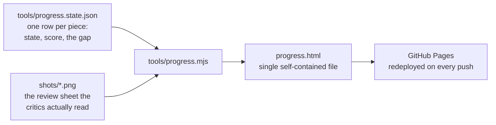
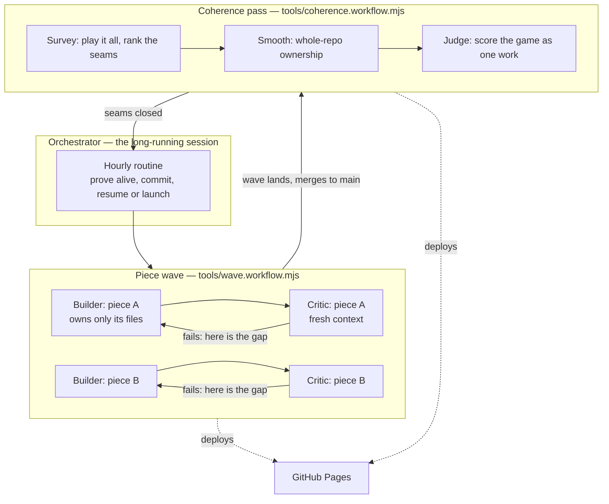
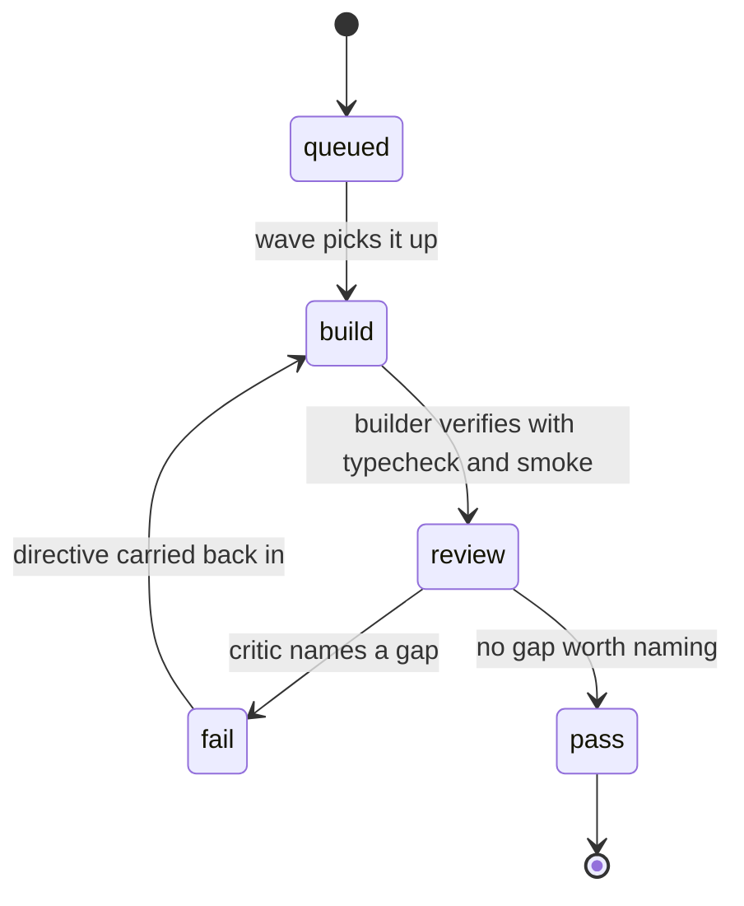
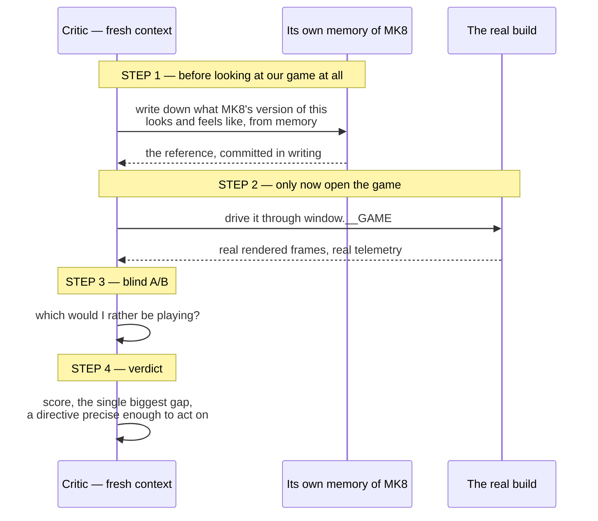
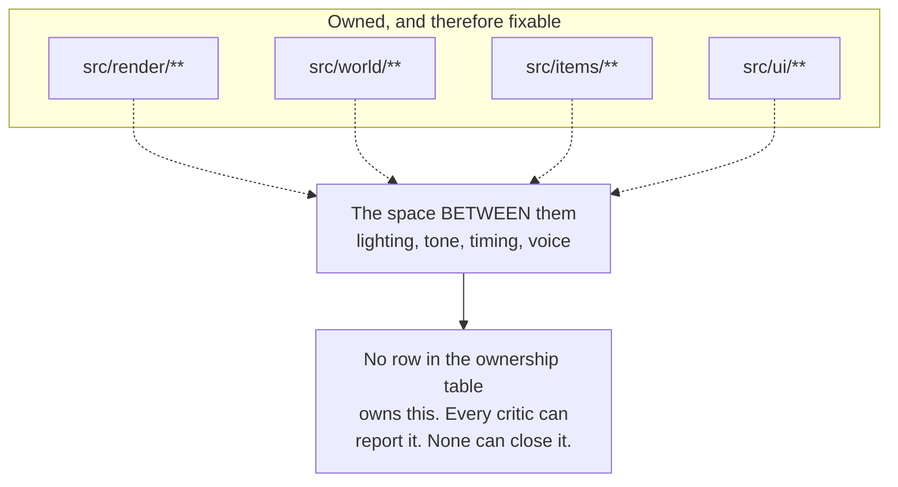
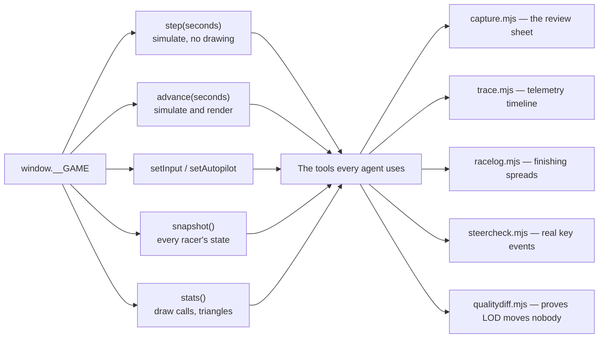
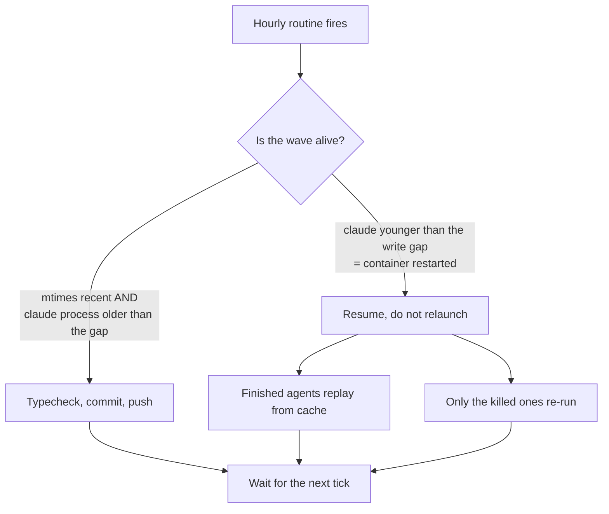

# How this game is being built

Nobody hand-wrote the TypeScript in this repository. It is built by a fleet of
Claude Code agents working in parallel, judged by other agents, on a loop that
runs unattended for days.

This page explains the machinery — including **the live build board**, which is
the thing people usually ask about first.

---

## The build board

That's `progress.html`, and it's not a hosted service or a product — it's a
90-line script in this repo.

**Live: <https://adam91holt.github.io/mario.cone/progress.html>**

Two inputs, one output. `progress.state.json` is the ledger — every piece, its
current state, its score, and the exact gap its critic named. `shots/` holds the
frames from the last capture run. `progress.mjs` shrinks those frames to JPEG
data URIs, inlines them, and writes one HTML file with no external requests at
all.

I update the state file by hand after every wave lands, from the critics' actual
verdicts rather than their summaries. The board is honest because it's built from
the same measurements the loop runs on.

---

## The shape of the whole thing

Piece waves and the coherence pass **never run at the same time**, and that
constraint is load-bearing — see below.

---

## One piece, one loop

Every piece runs the same loop, and it does not stop because a round finished.
It stops when a critic cannot name a gap.

The bar is **8.5 out of 10 against Mario Kart 8 Deluxe**, and there is no fixed
round count. As of writing: 17 pieces, 10 failed, 6 awaiting a closing verdict,
1 queued, **0 passed**. Scores sit between 5.5 and 7.5.

That's not the loop failing. Every round the critics keep producing specific,
measured, actionable findings — and each fix hands the next critic a better game
to be harsh about.

---

## Why the critic is a separate agent

This is the part that makes the whole thing work, and it's mostly about denying
the critic the chance to be generous.

The critic never sees the builder's summary. It plays the build.

**Step 1 exists because of a specific failure mode**: an agent that looks at our
game first will unconsciously anchor to it, then recall a version of Mario Kart
that conveniently resembles what it just saw. Writing the reference down *first*
makes that impossible.

The verdicts this produces are not vibes:

> The menu stage casts no contact shadow: ground luminance under the digger's
> tracks reads **96.9 against 42.4** for the asphalt beside it. The same machine
> on the race grid a quarter-second later is correctly 30% darker.

> The player's item slot is empty for **87% of a race** — 3 draws in 145 seconds,
> one unbroken 63.7-second stretch with nothing.

> The quality governor sat at its top rung for **331 seconds at roughly 4 fps**
> without a single change.

A measurement like that becomes the *next* round's acceptance test, so the
builder has to run the race to know whether it passed rather than eyeball a
screenshot.

---

## File ownership, and the hole in it

Parallel agents in one repo need a rule or they trample each other. The rule is
that each piece owns a disjoint set of files, declared in `ARCHITECTURE.md` and
encoded in `src/types.ts` so `npm run typecheck` catches a cross-module break.

It works. It also has a blind spot that nothing inside it can fix:

The clearest example: **five separate critics failed five different pieces on
missing shadows** — the menu stage, the world geometry, the machines, the quality
ladder's floor rung, the carried items. Each diagnosed it correctly inside its
own module. None could fix it, because the sun's shadow camera belongs to render
while the `castShadow` flags live wherever each mesh is built. It was reported
five times and closed zero times.

So `tools/coherence.workflow.mjs` runs **one agent with the whole repo**, judged
by a critic scoring the game as a single work. Its first survey opened with:

> A bag of very good parts, and the parts know it — several files carry comments
> apologising for the space they cannot reach across.

It found the game was set in two different typefaces either side of the starting
flag, that eleven events were emitted every race into a room with no listeners
(which is why the wrong-way alarm had no alarm), and that eight racers were
finishing 6.5 km **inside 0.811 seconds of each other** — so the drift loop the
menus call "the real game" was something a player never once saw happen.

---

## How an agent sees the game

Everything rests on the simulation being deterministic: gameplay runs in
`fixedUpdate(dt)` at a fixed 120 Hz against a seeded RNG, with no `Math.random()`
and no wall-clock reads. Same seed plus same inputs gives the same race, frame
for frame. That's what makes a screenshot reproducible and a bug report a seed
plus a timestamp.

`steercheck.mjs` earns its place with a cautionary tale. **Steering was mirrored
for a long time and the harness structurally could not catch it**, because
`setInput()` writes the virtual input and short-circuits the exact device path
that was broken. The AI drove correctly throughout — its maths was right — while
a comment above it asserted the opposite convention on every count. The keyboard
mapping had been written to match the comment. So that tool drives *real key
events* and measures which way the kart actually went.

---

## Surviving the machine it runs on

The container suspends without warning every 35–90 minutes, killing every
in-flight agent.

The decisive liveness test isn't file timestamps — it's the **age of the main
`claude` process**. If it has been alive for less time than the gap since the
last agent write, the container restarted and everything in flight is dead, no
matter how recent the files look. Sub-agents run *in-process*, so `ps aux | grep
claude` shows nothing for a perfectly healthy wave.

Resuming with byte-identical arguments replays completed agents from cache and
re-runs only the dead ones, carry intact. A suspend now costs the in-flight
agents, not the wave.

---

## The prompts are in here too

Since none of the code was hand-written, the conversation is closer to the source
than `src/` is — so it's committed alongside it and refreshed every hour.

- **[`docs/session/prompts.md`](session/prompts.md)** — every prompt and reply.
- **[`docs/session/session.jsonl`](session/session.jsonl)** — the same with
  structure: messages, tool calls, tool results.

Most of those turns are the build loop waking *itself* on a schedule, not a
person typing.
